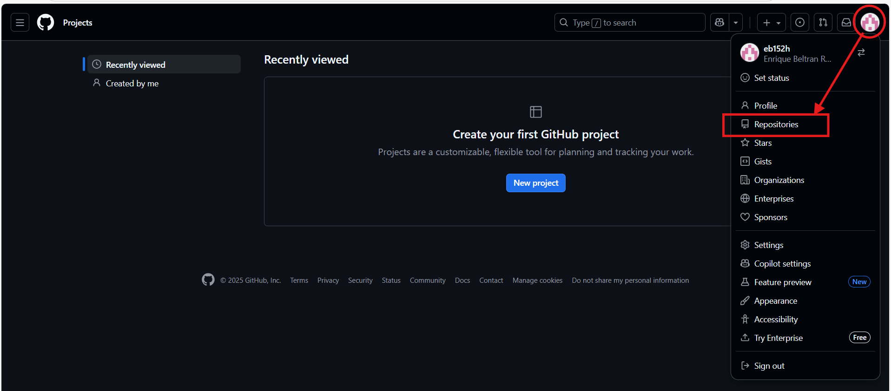
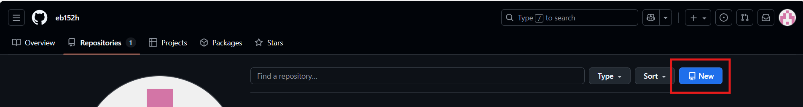
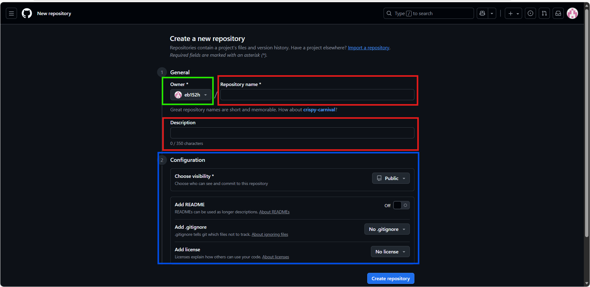

# Clase de Git y GitHub

## Crear repositorio en GitHub

1. Ingresar a  [GitHub](https://www.github.com){target="_blank"}

2. Dar click en el icono de `Perfil` y posterior click en `Repositorios`

3. Dar click en el boton `New`

4. LLenar los datos del repositorio.
    -   Nombre de repositorio.
    -   Descripcion
    -   En `Configuracion` puedes indicar si quieres que el repositorio sea `Publico` o `Privado`

