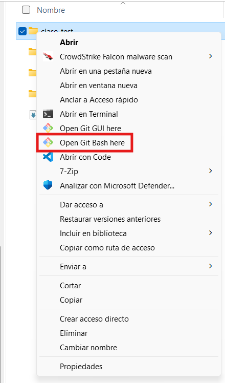
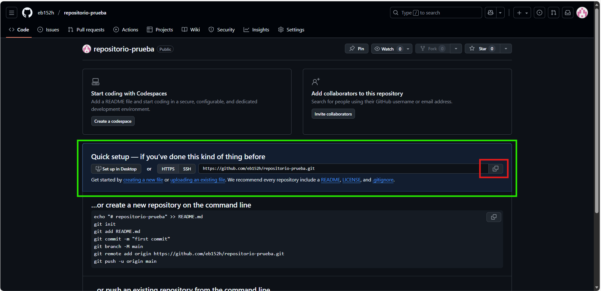

## Clonar repositorio

1. Crear una carpeta en para clonar el repositorio, damos click derecho sobre la carpeta creada y seleccionarmos `Open Git Bash here`.


2. Al ingresar a nuestro repositorio desde GitHub, en el apartado de `Configuracion rapida` podemos copiar la URL para poder clonarlo.


3. Desde Git Bash escribimos el comando `git clones url` para descargar (Clonar) el repositorio desde Git Hub.
```bash
git clone https://github/usuario/repositorio.git
```